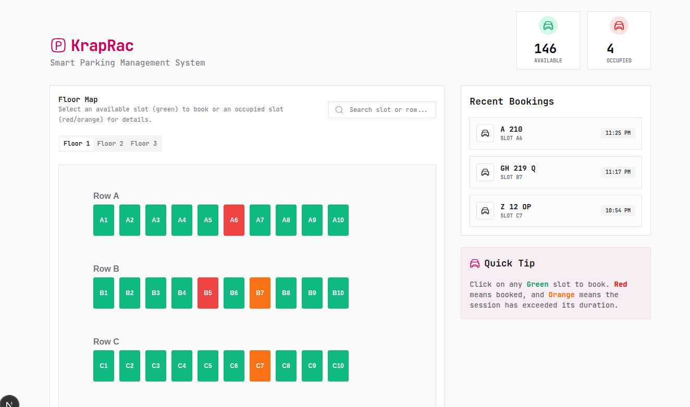

# KrapRac - Smart Parking Management System

A modern, interactive parking slot booking and management application built with **Next.js**, featuring a visual interactive map powered by **React Konva**.



## 🚀 Overview

KrapRac is designed to simplify parking management with a visual-first approach. It provides a real-time view of parking availability across multiple floors, allowing users to book slots, track parking duration, and manage active sessions with ease.

## ✨ Key Features

- **Interactive 2D Map**: A canvas-based visual layout of parking slots and rows.
- **Real-time Status Tracking**: 
  - 🟢 **Available**: Ready for booking.
  - 🔴 **Occupied**: Currently in use.
  - 🟠 **Overtime**: Booking duration exceeded (calculated live).
- **Booking Management**: Streamlined flow to reserve slots with vehicle and user details.
- **Live Countdowns**: Real-time remaining time and overtime tracking for all active bookings.
- **Search & Filters**: Quickly find slots by name or row across different floors.
- **Multi-floor Support**: Seamlessly switch between parking levels.
- **Persistence**: Data is persisted locally using Browser Local Storage.

## 🛠️ Tech Stack

- **Framework**: [Next.js](https://nextjs.org/) (App Router)
- **Language**: [TypeScript](https://www.typescriptlang.org/)
- **Visuals**: [React Konva](https://konvajs.org/docs/react/index.html) for interactive canvas rendering.
- **Styling**: [Tailwind CSS v4](https://tailwindcss.com/) & [Shadcn UI](https://ui.shadcn.com/).
- **Icons**: [Hugeicons](https://hugeicons.com/).
- **State & Storage**: React Hooks & Local Storage.

## 🏃 Getting Started

### Prerequisites

Ensure you have [Node.js](https://nodejs.org/) and a package manager ([Bun](https://bun.sh/), [NPM](https://www.npmjs.com/), or [Yarn](https://yarnpkg.com/)) installed.

### Installation

```bash
# Clone the repository
git clone <repository-url>
cd kraprac-frontend

# Install dependencies
bun install # or npm install
```

### Development

Run the development server:

```bash
bun dev # or npm run dev
```

Open [http://localhost:3000](http://localhost:3000) with your browser to see the result.

### Build & Lint

```bash
# Production build
bun run build

# Linting
bun run lint
```

## 📂 Project Structure

- `src/app/`: Next.js App Router pages and global styles.
- `src/components/`: Core UI components.
  - `ParkingMap.tsx`: Canvas rendering logic.
  - `ParkingDashboard.tsx`: Main dashboard and stats.
  - `BookingFlow.tsx`: Modals for booking and session details.
  - `ui/`: Reusable primitive components (Shadcn UI).
- `src/dummy-data/`: Initial data structures, types, and constants (`slots.ts`).
- `src/lib/`: Utility functions and Local Storage logic (`storage.ts`).
- `src/hooks/`: Custom React hooks for business logic.

## 📋 Development Conventions

### Visual Parking Map
The parking layout is managed in `src/dummy-data/slots.ts`. Constants like `SLOT_WIDTH`, `SLOT_HEIGHT`, and `SLOT_GAP` define the grid system. When adding new visual elements, ensure they align with the Konva coordinate system.

### Status Logic
Slots are maintained as `available` or `booked`. The "Overtime" status is derived dynamically by comparing the current timestamp against the `startTime` and `duration` stored in the booking record.

### Styling
Prefer **Vanilla CSS** or **Tailwind CSS** classes. Follow the established Shadcn UI patterns for consistency in spacing, typography, and interactive feedback.
